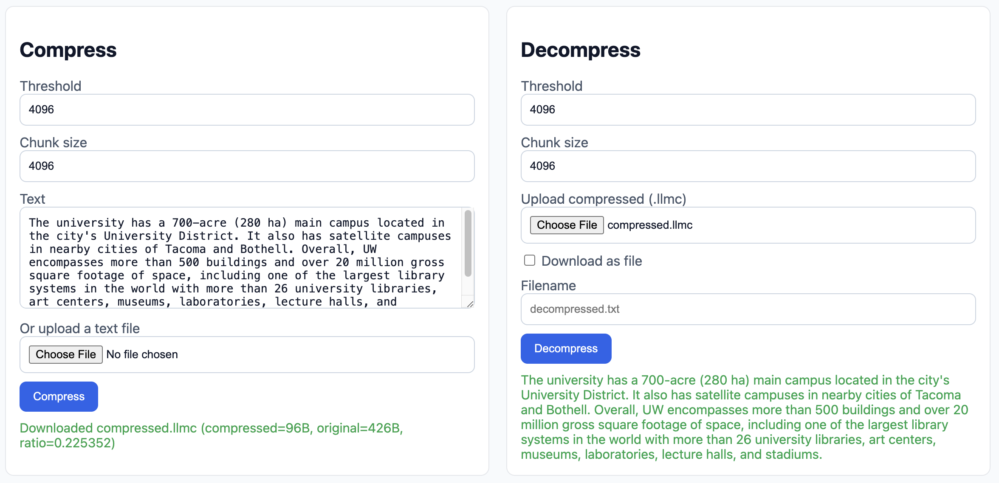
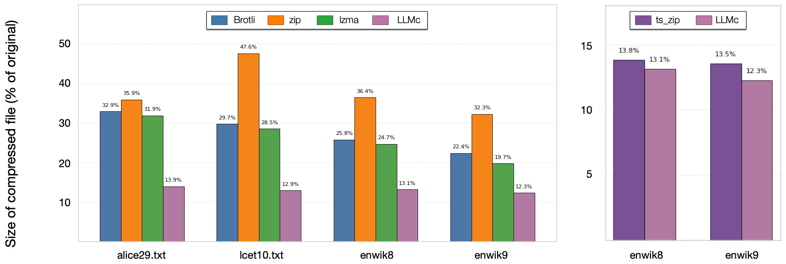

<p align="center">
  
</p>

<p align="center">
  <a href="https://syfi.cs.washington.edu/blog/2025-10-03-llmc-compression">Blog</a> |
  <a href="https://github.com/uw-syfi/llmc">Code</a>
</p>

LLMc is a language-model–powered compressor for natural language text. It encodes token ranks instead of raw token IDs and stores them with a compact format.

## Design

The core idea of LLMc is rank-based encoding. During inference, the LLM provides a probability distribution over possible next tokens. In most cases, the true next token ranks among the top few candidates. Instead of storing the token identity, LLMc stores its rank within the distribution. These ranks are small integers and therefore are compact to encode.

https://github.com/user-attachments/assets/1404079e-7fb6-4499-af24-2f192c7e59dc

## Installation

We recommend using uv to manage the virtual environment.

```bash
uv venv -p 3.11
# We use a modified version of vLLM and batch_invariant_ops as backend.
git submodule update --init --recursive
export VLLM_USE_PRECOMPILED=1
uv sync
```

## CLI Usage

The CLI exposes three subcommands. The examples below mirror the arguments defined in `llmc/entrypoint/cli.py`.

### 1) Compress

Write a `.llmc` binary (varint+brotli):

```bash
llmc compress input.txt output.llmc \
  --model Qwen/Qwen3-8B \
  --threshold 256 \
  --chunk-size 4096 \
  --gpu-mem 0.5
```

Notes:
- `--threshold` and `--chunk-size` are required.
- `output.llmc` is a raw byte stream.

### 2) Decompress

Turn a `.llmc` file back into text:

```bash
llmc decompress output.llmc restored.txt \
  --model Qwen/Qwen3-8B \
  --threshold 256 \
  --chunk-size 4096 \
  --gpu-mem 0.5
```

### 3) Serve (Web + API)

Run the FastAPI server and web frontend:

```bash
llmc serve \
  --model Qwen/Qwen3-8B \
  --max-threshold 256 \
  --max-chunk-size 4096 \
  --gpu-mem 0.5 \
  --host 0.0.0.0 --port 8000
```

The server enforces upper bounds via `--max-threshold` and `--max-chunk-size`. The web UI sends per-request `threshold` and `chunk_size` that must be ≤ these limits.

## Web Frontend

Open the browser at `http://<host>:8000` after starting the server. Enter Threshold and Chunk size for each operation.

<p align="center">
  
</p>

## Results

Compression ratio with comparison to various traditional algorithms.

<p align="center">
  
</p>

## Acknowledgements

- Built on a custom vLLM fork and `batch_invariant_ops`.
- Thanks to the open-source ecosystem for models and tooling.
